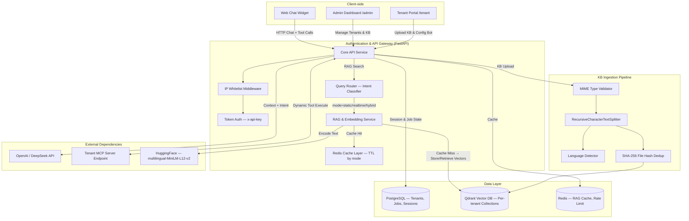

# Platform Architecture: SaaS Chatbot CMS

Tài liệu này mô tả chi tiết kiến trúc tầng ứng dụng, cơ sở dữ liệu và luồng giao tiếp dữ liệu giữa các thành phần trong hệ thống.

> Cập nhật lần cuối: Mar 22, 2026 — thêm Hybrid Search (BM25 + RRF), bm25_store service.

---

## 1. High-Level Architecture Diagram



---

## 2. Các Modules Chức năng

### A. Core API Service (`/api/routers/`)

| Router | Vai trò |
|--------|---------|
| `admin.py` | CRUD Tenant: đăng ký, cấu hình Bot (tên, avatar, prompt, industry, greeting), Topup Quota |
| `auth.py` | Xác thực phiên làm việc |
| `chat.py` | Luồng Chat: tạo session → gọi LLM → xử lý Tool Calling / MCP calls |
| `kb.py` | KB Ingestion Pipeline (xem mục 4). Hỗ trợ Static KB và Realtime KB có TTL |
| `rag_search.py` | Proxy tìm kiếm RAG cho Next.js route.ts — tự động chạy qua Query Router trước |
| `crm.py` | (Tuỳ chọn) Đồng bộ dữ liệu CRM |

### B. Business Services (`/api/services/`)

| Service | Vai trò |
|---------|---------|
| `rag.py` | Embedding bằng `paraphrase-multilingual-MiniLM-L12-v2`. Ingest / Search / Soft-delete Qdrant. Hàm search hỗ trợ trả về payload chi tiết (`return_dicts=True`). |
| `bm25_store.py` | BM25 lexical index per-tenant (`rank-bm25`). Hỗ trợ tiếng Việt bằng regex tokenizer. Cung cấp `reciprocal_rank_fusion()` để merge dense + lexical. |
| `query_router.py` | Phân luồng câu hỏi: keyword match → trả `(mode, categories)`. mode = `static` / `realtime` / `hybrid` |
| `cache.py` | Redis TTL theo mode: static=3600s, realtime/pricing=900s, hybrid=600s. Hỗ trợ `invalidate_by_collection` và `invalidate_by_category` |
| `llm.py` | Wrapper gọi DeepSeek / OpenAI API |
| `mcp.py` | Resolve schema từ MCP Server URL của Tenant, tạo Function Spec gửi LLM |
| `analytics.py` | Bắt luồng lưu Async RAG query log cho Dashboard phân tích Miss Rate (Zero-Latency). Cung cấp endpoint cleanup bảo trì DB. |

### C. Data Models (`/api/models/tenant.py` — SQLAlchemy)

| Model | Nội dung |
|-------|----------|
| `Customer` | `id, email, api_key, max_requests, qdrant_collection, bot_name, bot_avatar, mcp_server_url, system_prompt, industry, ...` |
| `ChatSession` & `ChatMessage` | Lịch sử trò chuyện toàn bộ |
| `KBJob` | Tracking Jobs ingestion: `job_id, filename, status, total_chunks, processed_chunks, file_hash` |
| `RagAnalyticsLog` | Background logs theo dõi Search Mode, queries và retrieved chunks dạng `JSONB` để thống kê Hit/Miss Rate. |

### D. Frontend Application (`/chatbot-ui/app/`)

| Path | Vai trò |
|------|---------|
| `middleware.ts` | IP Whitelist cho `/admin` và `/tenant`: chặn request từ IP không nằm trong `ALLOWED_ADMIN_IPS` |
| `app/api/chat/route.ts` | LLM Orchestration: inject KB context, inject industry/greeting, tool calling, MCP toolkit |
| `app/admin/` | Super Admin Dashboard: quản lý Tenants, KB, Config |
| `app/tenant/` | Tenant Portal: self-service upload KB, xem chat history, chỉnh sửa Bot config |
| `app/widget/[tenantId]/` | Giao diện Chatbot nhúng — render Tool UI (PricingCard, BuyForm, ...) |
| `app/widget/error.tsx` | Route-level Error Boundary: cô lập widget không crash app chính |

---

## 3. KB Ingestion Pipeline (Chi tiết)

```
Upload (HTTP multipart)
    │
    ▼
MIME Type Validation (python-magic, libmagic1)
    │    ← block .exe, .sh, ... giả đuôi .pdf
    ▼
SHA-256 File Hash
    │    ← Nếu hash == KBJob cũ có status="completed" → SKIP toàn bộ (tiết kiệm CPU)
    ▼
Delete Old Vectors by Filename (Qdrant)
    │    ← Xóa vector cũ trước khi ingest lại
    ▼
Extract Text
    ├── PDF  → list[{text, page_num}]  ← giữ source_page per chunk
    ├── XLSX/CSV → list[str] (1 row = 1 doc)
    └── TXT/MD/JSON → str
    │
    ▼
Chunking (theo loại KB)
    ├── policy  → RecursiveCharacterTextSplitter(800, overlap=150)
    ├── general → RecursiveCharacterTextSplitter(600, overlap=100)
    ├── faq     → split by \n\n (giữ Q&A pair)
    └── tabular → không chunk (1 row = 1 doc đã tách từ Extract)
    │
    ▼
Language Detection (langdetect) → metadata.language = "vi"/"en"/"unknown"
    │
    ▼
Rich Metadata per Chunk:
    {filename, type, kb_type, customer_id, chunk_index, total_chunks,
     file_hash, ingested_at, job_id, language, source_page (PDF only)}
    │
    ▼
Ingest → Qdrant (upsert)
    │
    ▼
Update KBJob (status=completed, processed_chunks, file_hash)
    │
    ▼
Cleanup /tmp temp file + invalidate Redis cache
```

---

## 4. RAG Query Flow

```
User Question (từ Widget/Chat)
    │
    ▼
route.ts → GET /rag/search?q=...&hybrid=true
    │
    ▼
Query Router (services/query_router.py)
    │   keyword match: "giá", "khuyến mãi" → mode=realtime
    │   keyword match: "chính sách", "hướng dẫn" → mode=static
    │   cả hai → mode=hybrid
    ▼
Hybrid Search (services/rag.search_hybrid)
    │
    ├── Check Redis Cache (TTL by mode)
    │       hit → return cached
    │       miss ↓
    │
    ├── [Dense] Qdrant query_points(threshold=0.25, pool=top_k×4)
    │       + Apply kb_type filter (static/realtime/hybrid+TTL)
    │
    ├── [BM25] bm25_store.search(query, pool=top_k×4)
    │       tokenize_vi → BM25Okapi.get_scores → top IDs
    │
    ├── RRF Merge (k=60) → top_k×4 unified
    │
    ├── qdrant.retrieve(merged_ids) → fetch payload
    │
    ▼
Return top_k chunks (by RRF rank) → inject vào LLM Prompt

[Fallback: ?hybrid=false hoặc BM25 store trống → pure dense search()]
```

---

## 5. Security Architecture

| Layer | Cơ chế |
|-------|--------|
| Network | Nginx reverse proxy — rate limit, gzip, upload 60MB max |
| Admin/Tenant Routes | IP Whitelist (`ALLOWED_ADMIN_IPS`) — NextJS Middleware + FastAPI Middleware |
| API Calls | `x-api-key` Header Authentication — per-tenant key |
| KB Upload | MIME Type Validation (byte-level, `python-magic`) |
| Swagger Docs | `/docs` public (client APIs only) · `/system-docs` HTTP Basic Auth (toàn bộ) |

---

## 6. Deployment Services (docker-compose)

| Service | Container | Vai trò |
|---------|-----------|---------|
| `api` | `chatbot-api` | FastAPI + Gunicorn 2 workers |
| `postgres` | `chatbot-postgres` | PostgreSQL — ORM state |
| `qdrant` | `qdrant` | Vector DB |
| `redis` | `chatbot-redis` | Cache + Rate Limit |
| `nginx` | `chatbot-nginx` | Reverse proxy, SSL termination |
| Next.js | (node process, ngoài Docker) | Frontend UI |

---

## 7. Roadmap còn lại (Chưa implement)

| Hạng mục | Trạng thái |
|----------|------------|
| Query Router tích hợp vào Chat Endpoint | 🔲 Hiện chỉ có trong `/rag/search` |
| Webhook `/realtime/invalidate` theo category | ✅ Done (kb.py) |
| Hybrid Search Phase 2 — Contextual Embeddings (Claude Haiku) | 🔲 Optional, cần `ANTHROPIC_API_KEY` — giảm thêm ~35% miss rate |
| Hybrid Search Phase 3 — CrossEncoder Reranker | 🔲 Optional, cần thêm RAM — tổng giảm ~67% miss rate |
| Bật hybrid mặc định trong route.ts | 🔲 Cần backfill BM25 indexes trước |
| Sensitivity Classifier + PII Sanitizer | 🔲 Chưa làm (Phase 4 — Zero-Upload RAG) |
| MCP Gateway on-premise + mTLS | 🔲 Chưa làm (Phase 4) |
| OCR cho file PDF dạng ảnh | 🔲 Chưa làm |
| Chat History UI trong Tenant Dashboard | 🔲 Placeholder, cần xây dựng |
